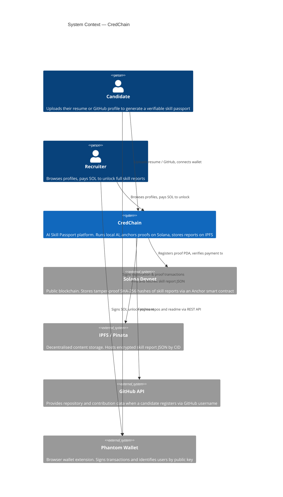
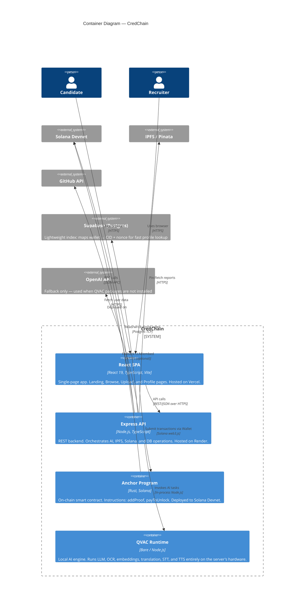
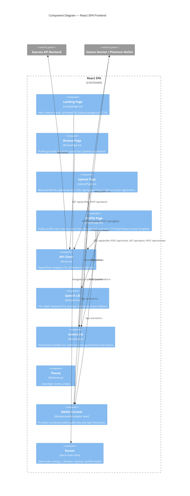
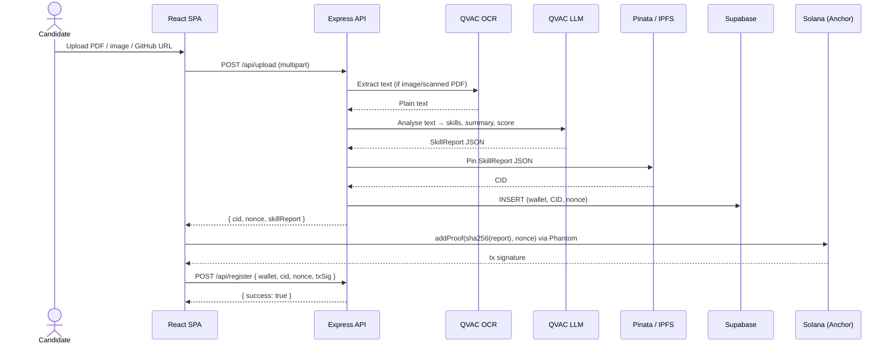
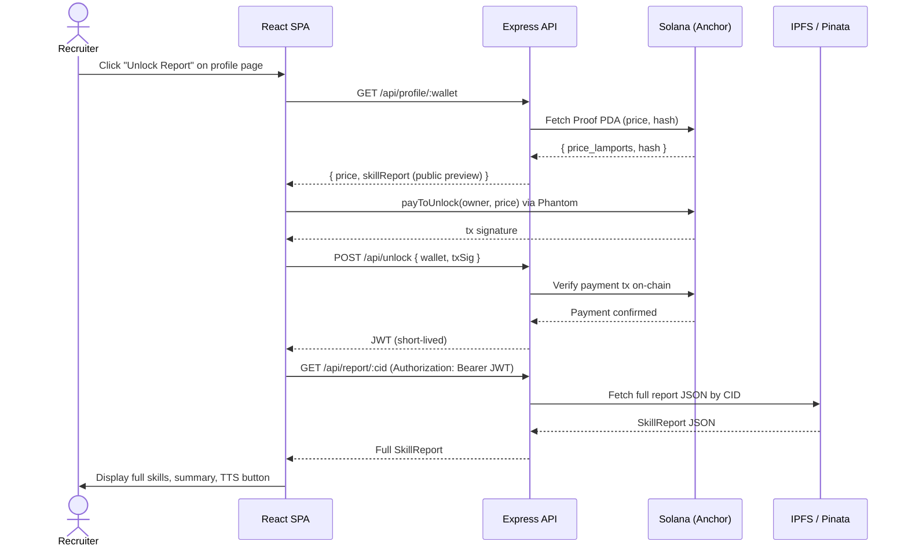

# CredChain — Architecture (C4 Diagrams)

Four levels of C4 diagrams rendered natively by GitHub via Mermaid.

---

## Level 1 — System Context

Who uses CredChain and what external systems does it talk to?

---

## Level 2 — Container Diagram

What are the deployable units inside CredChain?

---

## Level 3 — Component Diagram: Express API

What are the internal components of the backend?

```mermaid
C4Component
  title Component Diagram — Express API Backend

  Container_Ext(spa, "React SPA", "Calls REST endpoints")
  Container_Ext(qvac, "QVAC Runtime", "Local AI inference")
  System_Ext(solana, "Solana Devnet")
  System_Ext(ipfs, "IPFS / Pinata")
  System_Ext(supabase, "Supabase")
  System_Ext(openai, "OpenAI (fallback)")

  Container_Boundary(api, "Express API") {
    Component(upload, "Upload Route", "/api/upload", "Accepts PDF, image, or GitHub URL. Chains OCR → LLM → IPFS pin → DB write")
    Component(register, "Register Route", "/api/register", "Saves proof CID+nonce to Supabase after on-chain registration")
    Component(profile, "Profile Route", "/api/profile", "Fetches skill report from IPFS + unlock price from Solana PDA")
    Component(profiles, "Profiles Route", "/api/profiles", "Lists all registered profiles with public skill data")
    Component(unlock, "Unlock Route", "/api/unlock", "Verifies on-chain SOL payment, issues short-lived JWT")
    Component(report, "Report Route", "/api/report", "Serves full decrypted report — requires valid JWT")
    Component(search, "Search Route", "/api/search", "Embeds query, runs cosine similarity against in-memory vector store")
    Component(translate, "Translate Route", "/api/translate", "Translates report summary into target language via QVAC NMT")
    Component(speech, "Speech Route", "/api/speech", "Capabilities check, STT transcription, TTS synthesis endpoints")

    Component(aiAnalyzer, "AI Analyzer", "aiAnalyzer.ts", "Calls QVAC LLM (Mistral-7B) or OpenAI to extract skills, summary, score")
    Component(ocrExtractor, "OCR Extractor", "ocrExtractor.ts", "Runs QVAC OCR (ONNX) on images/scanned PDFs")
    Component(embeddings, "Embeddings Store", "embeddings.ts", "Maintains in-memory vector store using QVAC embeddings or TF-IDF fallback")
    Component(translator, "Translator", "translator.ts", "QVAC NMT translation with OpenAI fallback")
    Component(speechService, "Speech Service", "speechService.ts", "Lazy-loads Whisper STT and Chatterbox TTS QVAC addons")
    Component(solanaVerifier, "Solana Verifier", "solanaVerifier.ts", "Verifies payment tx and reads unlock price from on-chain PDA")
    Component(ipfsClient, "IPFS Client", "ipfsClient.ts", "Pins/fetches JSON via Pinata API")
    Component(githubFetcher, "GitHub Fetcher", "githubFetcher.ts", "Fetches repos and readmes from GitHub REST API")
  }

  Rel(spa, upload, "POST /api/upload")
  Rel(spa, register, "POST /api/register")
  Rel(spa, profile, "GET /api/profile/:wallet")
  Rel(spa, profiles, "GET /api/profiles")
  Rel(spa, unlock, "POST /api/unlock")
  Rel(spa, report, "GET /api/report/:cid")
  Rel(spa, search, "POST /api/search")
  Rel(spa, translate, "POST /api/translate")
  Rel(spa, speech, "GET /api/speech/capabilities, POST /api/speech/tts")

  Rel(upload, aiAnalyzer, "Analyse text")
  Rel(upload, ocrExtractor, "Extract text from image")
  Rel(upload, githubFetcher, "Fetch GitHub data")
  Rel(upload, ipfsClient, "Pin report")
  Rel(search, embeddings, "Query vectors")
  Rel(register, embeddings, "Index new profile")
  Rel(translate, translator, "Translate text")
  Rel(speech, speechService, "STT / TTS")
  Rel(unlock, solanaVerifier, "Verify payment")
  Rel(profile, solanaVerifier, "Read PDA price")
  Rel(profile, ipfsClient, "Fetch report")

  Rel(aiAnalyzer, qvac, "LLM inference")
  Rel(ocrExtractor, qvac, "OCR inference")
  Rel(embeddings, qvac, "Embed vectors")
  Rel(translator, qvac, "NMT translation")
  Rel(speechService, qvac, "STT / TTS inference")
  Rel(aiAnalyzer, openai, "Fallback")
  Rel(solanaVerifier, solana, "RPC")
  Rel(ipfsClient, ipfs, "Pin/fetch")
  Rel(upload, supabase, "Write CID+nonce")
  Rel(profile, supabase, "Read CID+nonce")
```

---

## Level 3 — Component Diagram: React SPA

What are the internal pages and shared modules of the frontend?

---

## Level 4 — Code: Upload & Registration Flow

Sequence of calls when a candidate uploads a resume and registers on-chain.

---

## Level 4 — Code: Recruiter Unlock Flow

